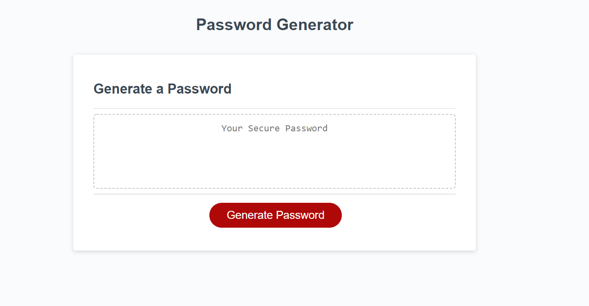
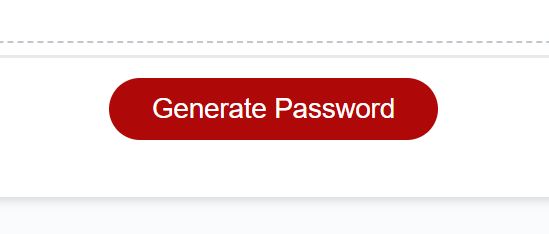
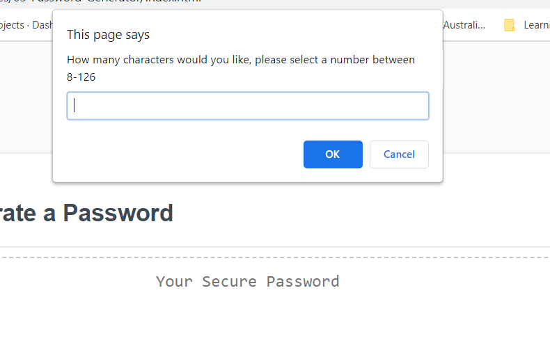
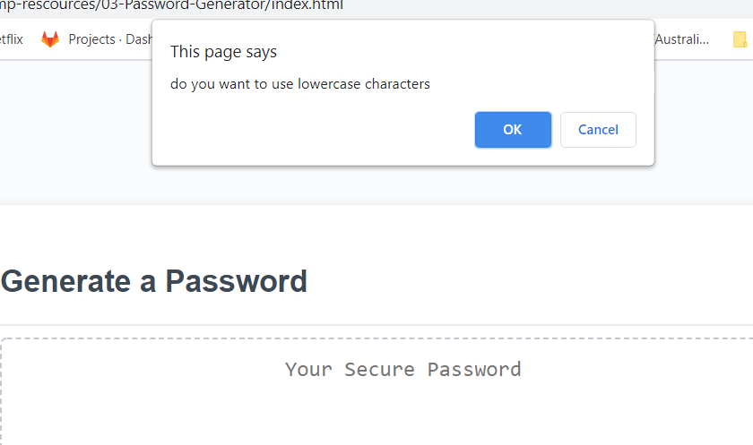
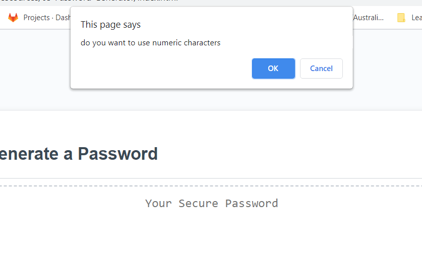
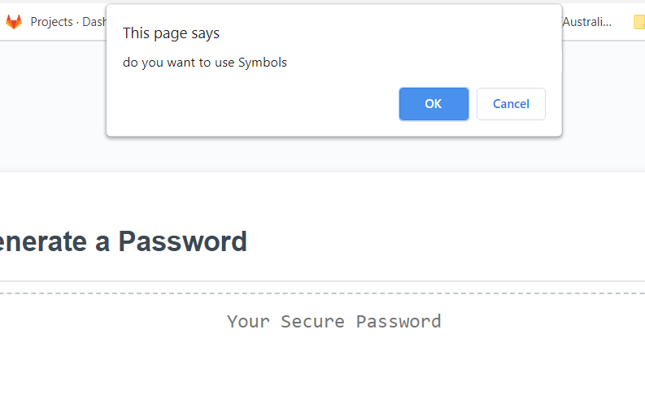
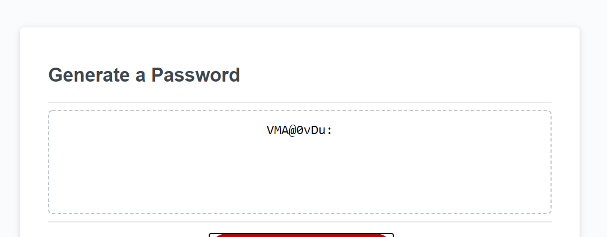

<h1>Password-Generator</h1>

This application was designed to generate a random password, from a set of variables determined by the user.
 

this project has been deployed to HitHub pages.

<h2>Summary</h2>

This application uses Javascript, HTML and CSS to great a random password generator, it specifically uses Javascript to make dynamic changes to the HTML document

<h2>Features</h2>
<h3>Generate button<h3>

this will send the user a number of prompts and confirms that will set the parameters for the password>

these parameters are then combined together and a password is generated

<h3>Length prompt<h3>

This prompts the user to enter a password length between 8 and 126 

<h3>Use uppercase</h3>

This asks the user to confirm if they would like uppercase characters to be used in their password

<h3>Use Lowercase</h3>

This asks the user to confirm if they would like lowercase characters to be used in their password

<h3>Use Numbers</h3>

This asks the user to confirm if they would like Number characters to be used in their password

<h3>Use Symbols</h3>

This asks the user to confirm if they would like symbol characters to be used in their password

<h3>Text area display</h3>

This area displays the randomly generated password for the user to view

